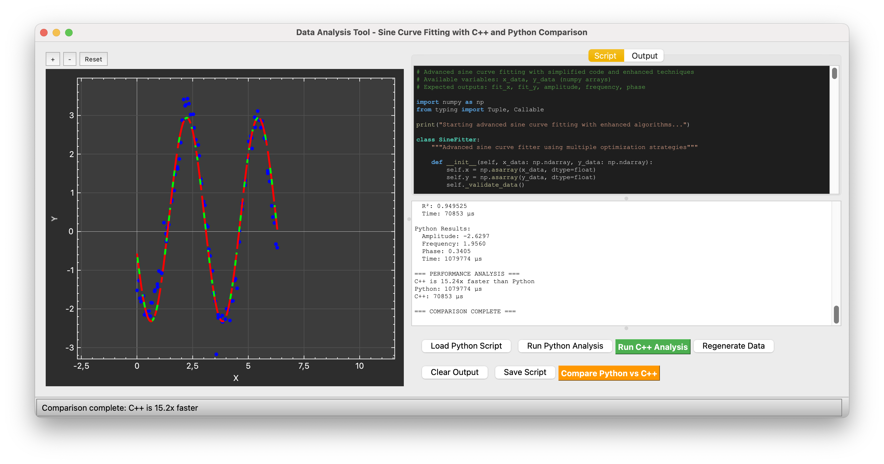

# cpppython
a proof of concept for c++ gui, compiled and using python scripts for analysis.

This combines pybind11, with QT to create a basic interface, with a text editor, script loading and etc. I am mostly doing this to play QT platting and to see how well this external scripting system can work. 

Inheriently a user should have a nice, fast compiled version of an interface, that prevents people from breaking, or slowing it down, while being able to access analysis software/scripts to use for themselves, should they want to edit them.

